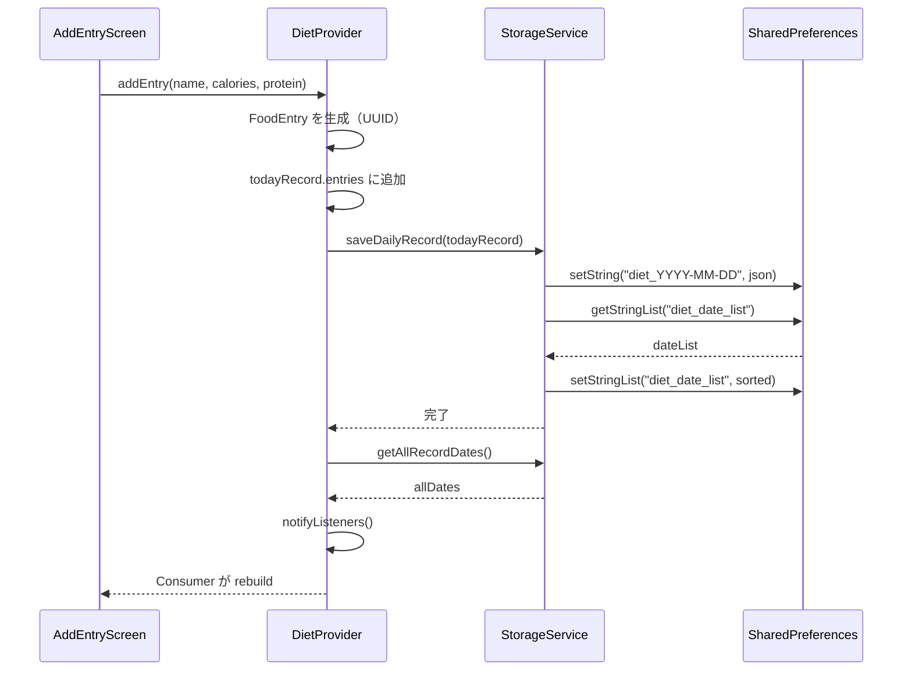
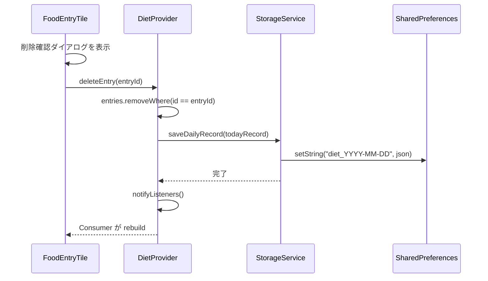
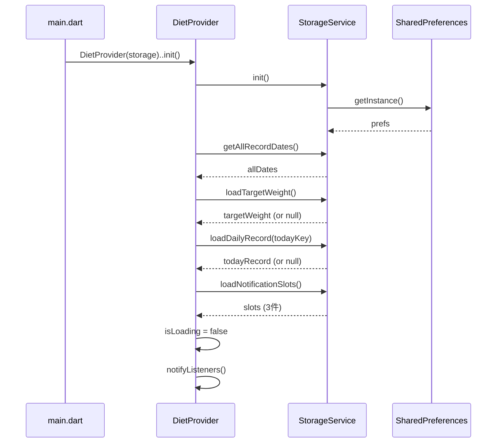
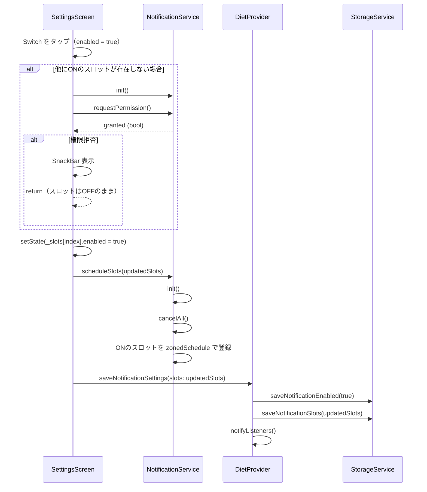

# API 設計

## DietProvider (`lib/providers/diet_provider.dart`)

### メソッド一覧

| メソッド | 引数 | 戻り値 | 説明 |
|---|---|---|---|
| `init()` | なし | `Future<void>` | ストレージを初期化し、全日付・目標体重・今日の記録をロード |
| `addEntry()` | `name`, `calories`, `protein` | `Future<void>` | UUID を生成して今日の記録にエントリを追加・保存 |
| `deleteEntry()` | `entryId: String` | `Future<void>` | 今日の記録から指定 ID のエントリを削除・保存 |
| `setTargetWeight()` | `weight: double` | `Future<void>` | 目標体重を設定・保存。`calorieGoal` が自動更新される |
| `getRecordForDate()` | `dateKey: String` | `DailyRecord?` | 指定日の記録を返す。今日はメモリ、過去日はストレージから取得 |

### 通知メソッド

| メソッド | 引数 | 戻り値 | 説明 |
|---|---|---|---|
| `saveNotificationSettings()` | `slots: List<NotificationSlot>` | `Future<void>` | スロット設定を保存。`notificationEnabled` はスロットから自動導出 |

### ゲッター一覧

| ゲッター | 型 | 説明 |
|---|---|---|
| `todayRecord` | `DailyRecord` | 今日の日付の記録 |
| `allDates` | `List<String>` | 記録済み全日付キーの一覧（降順） |
| `isLoading` | `bool` | 初期化完了前は `true` |
| `targetWeight` | `double?` | 目標体重。未設定時は `null` |
| `calorieGoal` | `double?` | `targetWeight * 34`。未設定時は `null` |
| `notificationEnabled` | `bool` | いずれかのスロットが enabled なら `true`（スロットから導出） |
| `notificationSlots` | `List<NotificationSlot>` | 朝・昼・晩の3スロット（読み取り専用コピー） |

---

## StorageService (`lib/services/storage_service.dart`)

### メソッド一覧

| メソッド | 引数 | 戻り値 | 副作用 |
|---|---|---|---|
| `init()` | なし | `Future<void>` | SharedPreferences インスタンスを初期化 |
| `saveDailyRecord()` | `record: DailyRecord` | `Future<void>` | `diet_YYYY-MM-DD` キーに JSON 保存。日付リストにも追加（重複なし・降順ソート） |
| `loadDailyRecord()` | `dateKey: String` | `DailyRecord?` | `diet_YYYY-MM-DD` から JSON を読み込みデシリアライズ。未存在時は `null` |
| `getAllRecordDates()` | なし | `List<String>` | 降順ソート済み日付キーの一覧を返す |
| `saveTargetWeight()` | `weight: double` | `Future<void>` | `diet_target_weight` キーに保存 |
| `loadTargetWeight()` | なし | `double?` | `diet_target_weight` を返す。未設定時は `null` |
| `loadNotificationSlots()` | なし | `List<NotificationSlot>` | 朝・昼・晩の3スロットを読み込む。未保存時のデフォルトはすべて OFF（時刻は朝08:00 / 昼12:00 / 晩20:00） |
| `saveNotificationSlots()` | `slots: List<NotificationSlot>` | `Future<void>` | 各スロットの `enabled`・`hour`・`minute` を個別キーで保存 |
| `saveNotificationEnabled()` | `enabled: bool` | `Future<void>` | `diet_notification_enabled` キーに保存（内部用・スロットから導出した値を渡す） |

---

## シーケンス図

### 食事エントリの追加（addEntry）

### 食事エントリの削除（deleteEntry）

### アプリ起動時の初期化（init）

### 通知スロットのON/OFF切り替え（_toggleSlot）

