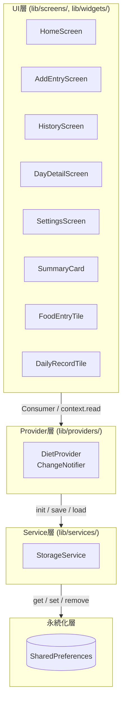
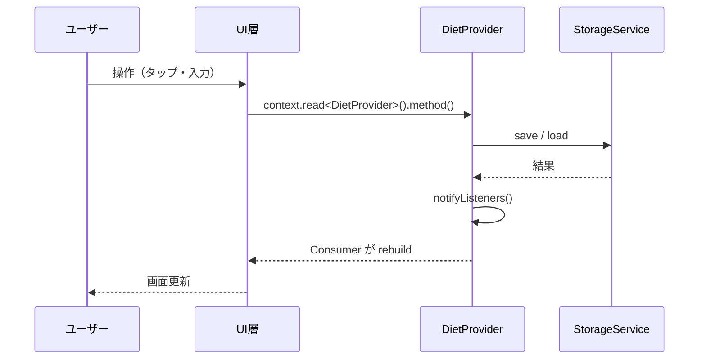

# アーキテクチャ設計

## レイヤー構成

アプリは 4 層のレイヤー構造で設計されています。依存は常に上位レイヤーから下位レイヤーへの一方向です。

## 各レイヤーの責務

| レイヤー | ファイル | 責務 |
|---|---|---|
| UI 層 | `lib/screens/`, `lib/widgets/` | ユーザーへの表示とインタラクション受付 |
| Provider 層 | `lib/providers/diet_provider.dart` | アプリ状態の保持・ビジネスロジック・UI への通知 |
| Service 層 | `lib/services/storage_service.dart` | 永続化の抽象化（SharedPreferences のラッパー） |
| 永続化層 | SharedPreferences | デバイスへのデータ保存 |

## 状態管理フロー

## 技術選定の理由

| 技術 | 採用理由 |
|---|---|
| Provider | Flutter 公式推奨の軽量状態管理。シンプルな ChangeNotifier パターンで小規模アプリに適する |
| SharedPreferences | 構造化 DB 不要なキー・バリュー形式のローカルデータに適する。JSON 文字列として DailyRecord を保存 |
| table_calendar | Flutter 向けで最も利用実績の多いカレンダーパッケージ。月表示・日付選択・マーカー表示が標準対応 |
| intl | 日本語ロケールの日付フォーマット（例: `2025年2月`）に使用 |
