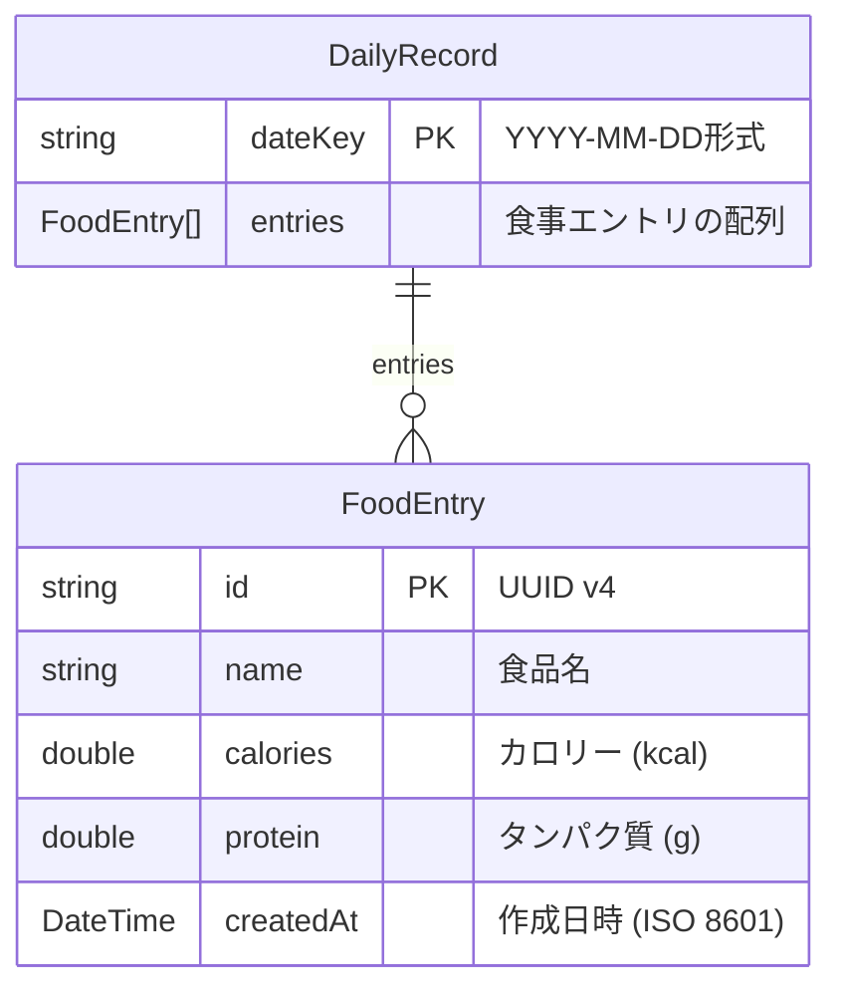

# データモデル設計

## ER 図



## モデル詳細

### DailyRecord (`lib/models/daily_record.dart`)

| フィールド | 型 | 説明 |
|---|---|---|
| `dateKey` | `String` | 日付キー。`YYYY-MM-DD` 形式（例: `2025-02-01`） |
| `entries` | `List<FoodEntry>` | その日の食事エントリ一覧 |

**算出プロパティ（getter）**

| プロパティ | 型 | 算出方法 |
|---|---|---|
| `totalCalories` | `double` | `entries` の `calories` 合計 |
| `totalProtein` | `double` | `entries` の `protein` 合計 |
| `entryCount` | `int` | `entries.length` |

### FoodEntry (`lib/models/food_entry.dart`)

| フィールド | 型 | 説明 |
|---|---|---|
| `id` | `String` | UUID v4 で生成される一意 ID |
| `name` | `String` | 食品名（例: `鶏むね肉`） |
| `calories` | `double` | カロリー（kcal） |
| `protein` | `double` | タンパク質（g） |
| `createdAt` | `DateTime` | エントリ作成日時 |

## SharedPreferences ストレージキー

| キー | 型 | 内容 |
|---|---|---|
| `diet_YYYY-MM-DD` | `String` | `DailyRecord` の JSON シリアライズ結果 |
| `diet_date_list` | `List<String>` | 記録済み日付キーの一覧（降順ソート済み） |
| `diet_target_weight` | `double` | 目標体重（kg）。未設定時は存在しない |

## JSON シリアライズ形式

### DailyRecord

```json
{
  "dateKey": "2025-02-01",
  "entries": [
    {
      "id": "550e8400-e29b-41d4-a716-446655440000",
      "name": "鶏むね肉",
      "calories": 150.0,
      "protein": 30.0,
      "createdAt": "2025-02-01T12:00:00.000"
    }
  ]
}
```
