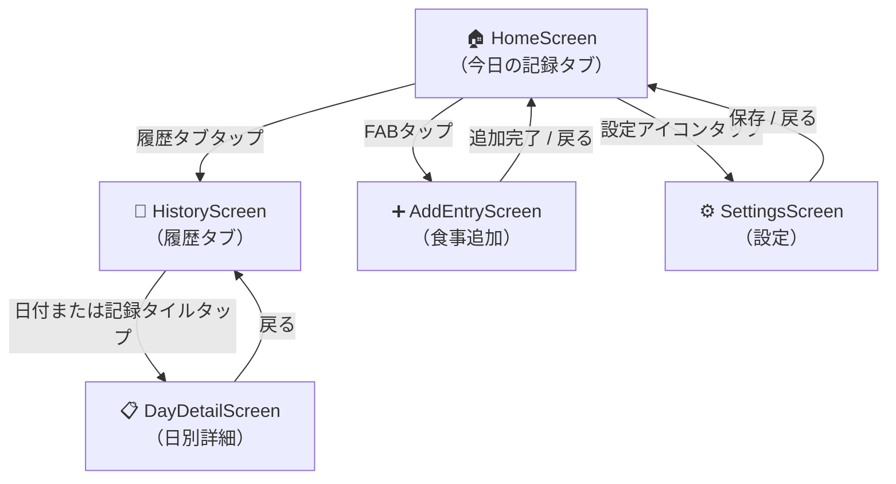

# 画面フロー設計

## 画面遷移図

## 画面一覧

### HomeScreen (`lib/screens/home_screen.dart`)

- **役割**: アプリのメインハブ。タブ切り替えで「今日の記録」と「履歴」を表示
- **今日タブ**: SummaryCard + 食事エントリリスト（削除ボタン付き）
- **FAB**: AddEntryScreen へ遷移
- **AppBar**: 設定アイコンで SettingsScreen へ遷移

### AddEntryScreen (`lib/screens/add_entry_screen.dart`)

- **役割**: 食事エントリの新規追加フォーム
- **入力項目**: 食品名（必須）、カロリー（必須・正数）、タンパク質（必須・正数）
- **完了後**: SnackBar 表示 → 前画面（HomeScreen）へ戻る

### HistoryScreen (`lib/screens/history_screen.dart`)

- **役割**: 月単位カレンダーで過去の記録を閲覧
- **カレンダー**: 記録がある日に緑のマーカー表示。矢印ボタンで月を切り替え
- **日付選択時**: カレンダー下部に選択日の DailyRecordTile を表示
- **未選択時**: 全記録のリスト表示（降順）
- **タイルタップ**: DayDetailScreen へ遷移

### DayDetailScreen (`lib/screens/day_detail_screen.dart`)

- **役割**: 特定日の食事記録の読み取り専用詳細ビュー
- **表示内容**: 日本語フォーマット日付（AppBar）、SummaryCard、食事エントリリスト
- **削除ボタン**: 表示しない（読み取り専用）

### SettingsScreen (`lib/screens/settings_screen.dart`)

- **役割**: 目標体重の設定
- **入力項目**: 目標体重（kg）
- **プレビュー**: 入力値に応じてカロリー目標（体重 × 34 kcal）をリアルタイム表示
- **保存後**: SnackBar 表示 → 前画面（HomeScreen）へ戻る
